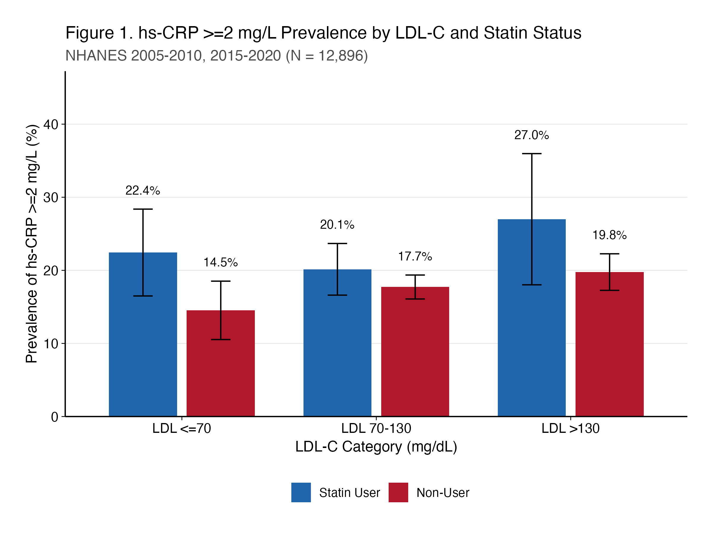
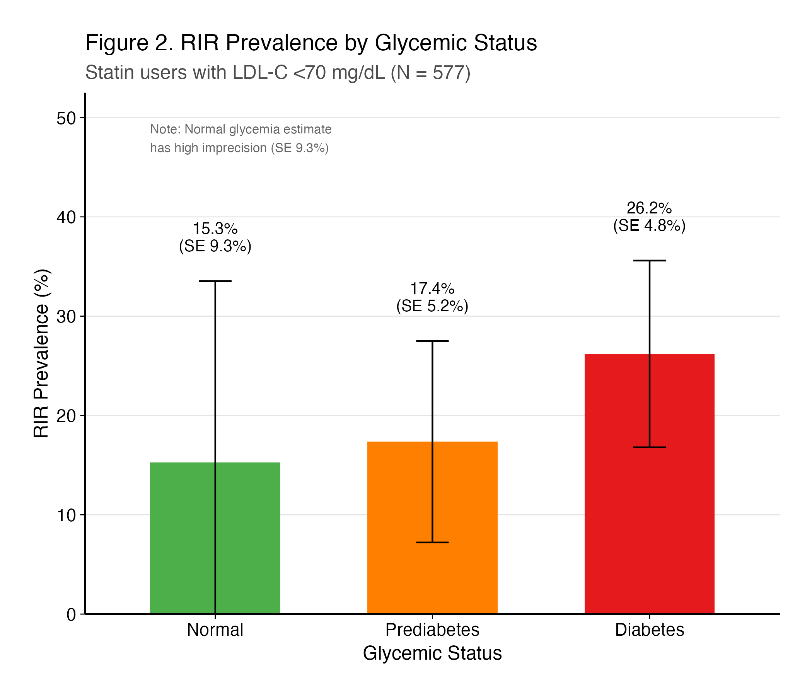
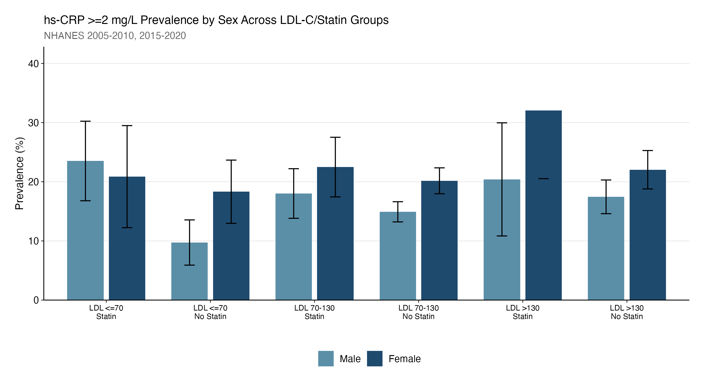
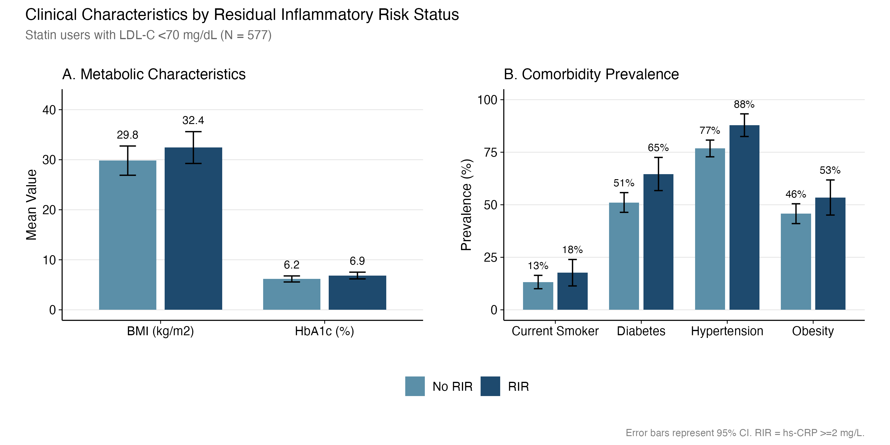
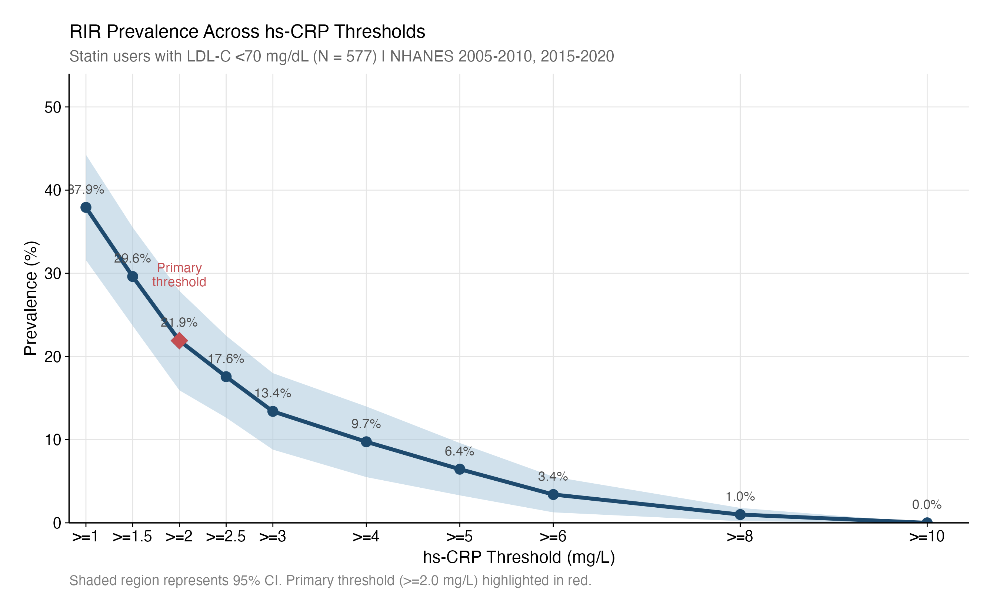
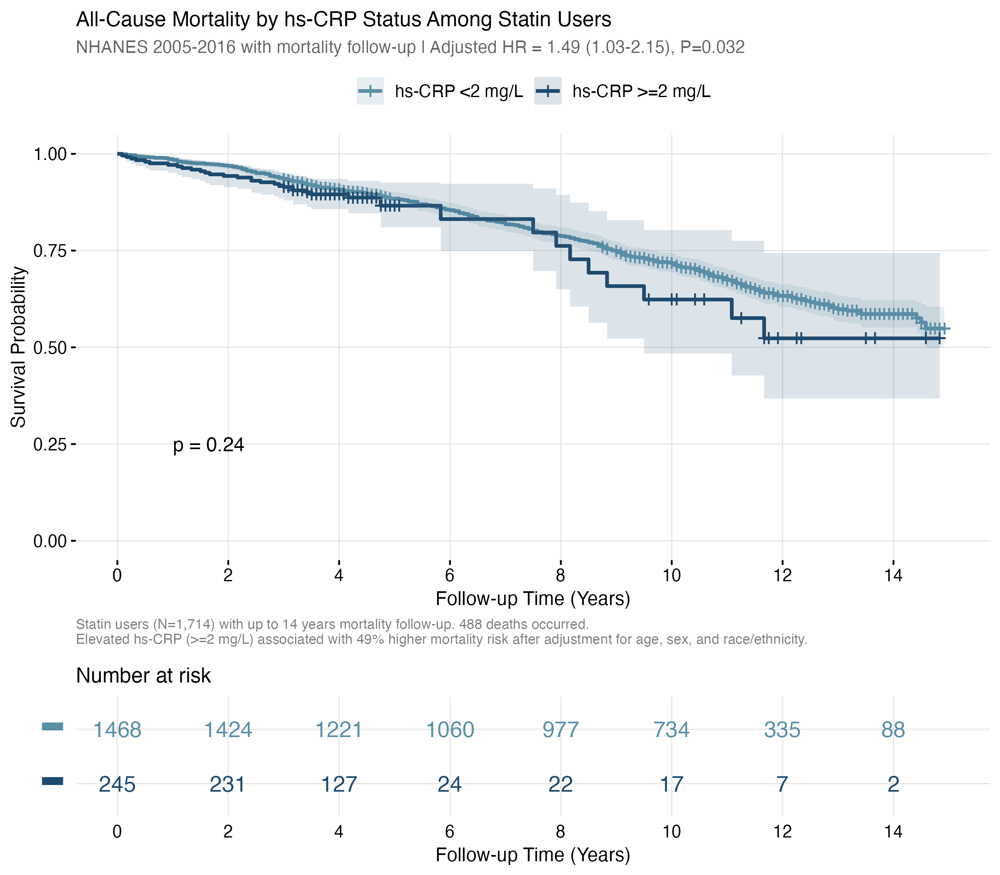
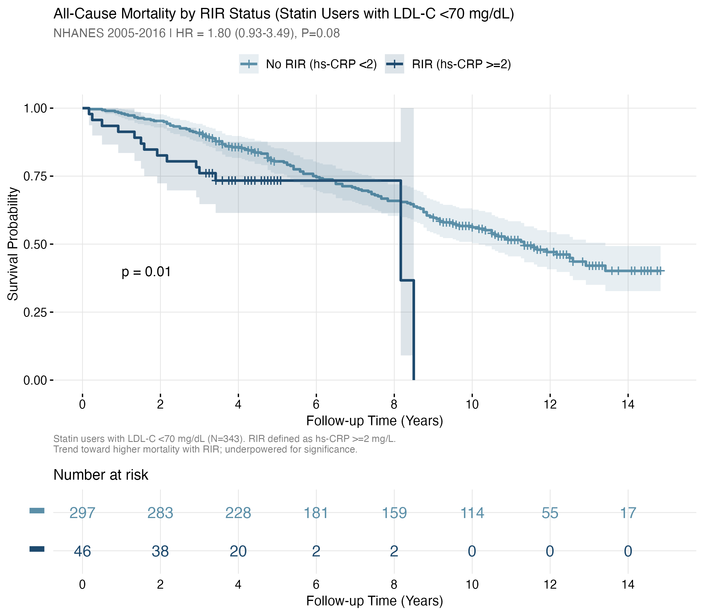

# Prevalence and Correlates of Residual Inflammatory Risk Among Statin-Treated U.S. Adults Achieving LDL-C <70 mg/dL: A Cross-Sectional Analysis of NHANES 2005-2020

---

## CLINICAL PERSPECTIVES

What Is Known: Clinical trials suggest that 30-40% of statin-treated patients maintain hs-CRP ≥2 mg/L despite LDL-C goal attainment. Anti-inflammatory therapies, including colchicine and canakinumab, reduce cardiovascular events in patients with residual inflammatory risk. However, no nationally representative U.S. estimates of residual inflammatory risk prevalence currently exist.

What Is New: Among statin-treated U.S. adults achieving LDL-C <70 mg/dL, 21.9% have residual inflammatory risk defined as hs-CRP ≥2 mg/L. Diabetics show nearly double the RIR prevalence compared to those with normal glycemia. BMI was associated with RIR in women but not men in exploratory sex-specific models, suggesting potential sex-specific inflammatory pathways that require confirmation.

Clinical Implications: These findings support consideration of hs-CRP measurement in statin-treated patients who have achieved lipid goals. Diabetics with well-controlled LDL-C may particularly benefit from inflammatory risk assessment. These findings raise the possibility that sex-specific approaches to inflammatory risk stratification could be informative and warrant further study.

---

## ABSTRACT

BACKGROUND: Statins reduce low-density lipoprotein cholesterol (LDL-C) and cardiovascular events, yet a substantial proportion of statin-treated patients maintain elevated high-sensitivity C-reactive protein (hs-CRP) despite achieving LDL-C goals. Nationally representative estimates of this residual inflammatory risk (RIR) phenotype in the U.S. population are lacking.

OBJECTIVES: To estimate the survey-weighted prevalence of RIR among statin-treated U.S. adults achieving LDL-C <70 mg/dL, and to characterize associations with glycemic status and sex in exploratory analyses.

METHODS: Cross-sectional analysis of National Health and Nutrition Examination Survey (NHANES) cycles 2005-2010 and 2015-2020. Adults aged ≥20 years with fasting lipid measurements and hs-CRP ≤10 mg/L were included. RIR was defined as concurrent statin use, LDL-C <70 mg/dL, and hs-CRP ≥2 mg/L. Survey-weighted prevalence estimates and logistic regression were performed accounting for complex survey design.

RESULTS: Among 12,896 fasting adults, 2,527 reported statin use (weighted prevalence 19.6%), of whom 577 achieved LDL-C <70 mg/dL. The survey-weighted RIR prevalence was 21.9% (95% CI: 15.9%-27.9%). In pre-specified exploratory analyses, statin users had higher hs-CRP ≥2 mg/L prevalence than non-users within each LDL-C tier. RIR prevalence was higher among participants with diabetes (26.2%) compared to those with normal glycemia (15.3%; standard error [SE] 9.3%, reflecting imprecision in the normal glycemia subgroup). In sex-specific models, body mass index (BMI) predicted RIR in women (odds ratio [OR] 1.07 per kg/m², P=0.02) but not men.

CONCLUSIONS: Approximately one in five statin-treated U.S. adults achieving LDL-C <70 mg/dL has residual inflammatory risk. These nationally representative estimates provide a foundation for prevention planning and suggest that hs-CRP screening may help identify candidates for adjunctive anti-inflammatory therapy evaluation in future outcome studies, particularly among patients with diabetes and well-controlled LDL-C.

---

## INTRODUCTION

Statins remain the cornerstone of pharmacotherapy for atherosclerotic cardiovascular disease (ASCVD) prevention, reducing major cardiovascular events by 20-30% through low-density lipoprotein cholesterol (LDL-C) lowering.¹ Current guidelines recommend intensive statin therapy with LDL-C targets <70 mg/dL for patients with clinical ASCVD or very high-risk primary prevention.² Despite widespread statin use and improved lipid control at the population level, substantial residual cardiovascular risk persists,³ prompting investigation of non-lipid pathways contributing to atherosclerosis progression.

Systemic inflammation, quantified by high-sensitivity C-reactive protein (hs-CRP), has emerged as a predictor of cardiovascular events independent of LDL-C.⁴,⁵ The concept of residual inflammatory risk, defined as persistent hs-CRP ≥2 mg/L despite statin therapy and lipid goal attainment, has gained clinical relevance following landmark trials demonstrating benefits of anti-inflammatory therapies. The CANTOS trial showed that interleukin-1β inhibition with canakinumab reduced cardiovascular events in patients with prior myocardial infarction and hs-CRP ≥2 mg/L despite statin therapy,⁶ establishing a causal role for inflammation in atherosclerosis. Subsequently, the COLCOT and LoDoCo2 trials demonstrated that low-dose colchicine reduces cardiovascular events in patients with established coronary artery disease,⁷,⁸ providing a practical, widely available anti-inflammatory approach now endorsed by clinical guidelines.⁹

Post-hoc analyses from high-intensity statin trials suggest that 30-40% of treated patients maintain hs-CRP ≥2 mg/L despite achieving LDL-C goals.¹⁰ However, these estimates derive from clinical trial populations with enriched cardiovascular risk. Nationally representative estimates of residual inflammatory risk among statin-treated individuals in the general U.S. population are lacking. Such estimates are essential for understanding the population-level burden of on-treatment inflammation, identifying candidates for adjunctive therapy, and characterizing high-risk subgroups. The American Heart Association's cardiovascular-kidney-metabolic (CKM) health framework further emphasizes the bidirectional relationship between metabolic dysfunction and chronic inflammation.¹¹

We therefore analyzed data from the National Health and Nutrition Examination Survey (NHANES) to estimate the weighted prevalence of residual inflammatory risk among statin-treated U.S. adults achieving LDL-C <70 mg/dL. In pre-specified exploratory analyses, we examined hs-CRP elevation across the spectrum of LDL-C levels and statin use, evaluated associations with glycemic status and sex, and identified demographic and clinical correlates of residual inflammatory risk.

---

## METHODS

### Data Source and Study Population

This analysis utilized publicly available data from the National Health and Nutrition Examination Survey (NHANES), a nationally representative, cross-sectional survey of non-institutionalized U.S. civilians conducted by the National Center for Health Statistics (NCHS).¹² NHANES employs a complex, multistage probability sampling design with oversampling of certain demographic groups to produce reliable subpopulation estimates.

Five survey cycles were included: 2005-2006, 2007-2008, 2009-2010, 2015-2016, and 2017-2020 (pre-pandemic). Cycles 2011-2014 were excluded due to limitations in harmonizing hs-CRP laboratory data across the analytic pipeline. The 2017-2020 cycle combined pre-pandemic data from 2017-2018 and 2019-March 2020 per NCHS analytic guidance.

Participants were eligible if they were aged ≥20 years, attended the mobile examination center and provided a fasting blood sample (required for LDL-C calculation), had measured hs-CRP, and had prescription medication data available for statin ascertainment. Participants with hs-CRP >10 mg/L were excluded to remove acute inflammation likely reflecting infectious or transient inflammatory processes rather than chronic cardiovascular risk.¹³

### Variable Definitions

Current statin use was ascertained from NHANES prescription medication interview files (RXQ_RX). Participants were classified as statin users if they reported taking any HMG-CoA reductase inhibitor in the past 30 days, identified through generic drug name matching (atorvastatin, simvastatin, rosuvastatin, pravastatin, lovastatin, fluvastatin, pitavastatin) and Multum Lexicon therapeutic classification code 358.

LDL-C was calculated using the Friedewald equation: LDL-C = total cholesterol − HDL-C − (triglycerides/5), expressed in mg/dL.¹⁴ Calculations were restricted to participants with triglycerides <400 mg/dL, above which the Friedewald equation becomes unreliable.

hs-CRP was measured in serum using latex-enhanced nephelometry.¹⁵ The threshold of ≥2 mg/L was used to define elevated inflammatory risk based on established cardiovascular risk stratification guidelines.¹⁶

Diabetes was defined as HbA1c ≥6.5%, fasting plasma glucose ≥126 mg/dL, self-reported physician diagnosis, or current use of insulin or oral hypoglycemic agents, consistent with American Diabetes Association criteria.¹⁷ Prediabetes was defined as HbA1c 5.7-6.4% or fasting glucose 100-125 mg/dL in the absence of diabetes.¹⁷ Participants were categorized into mutually exclusive glycemic status groups: diabetes, prediabetes, or normal glycemia.

Hypertension was defined as systolic blood pressure ≥130 mm Hg, diastolic blood pressure ≥80 mm Hg (mean of up to three measurements), or self-reported current use of antihypertensive medication.¹⁸ Obesity was defined as body mass index (BMI) ≥30 kg/m², calculated from measured height and weight. Current smoking was defined as self-report of ≥100 lifetime cigarettes and currently smoking every day or some days. Self-reported race and Hispanic origin were combined into five categories per NHANES public-use file classifications: Mexican American, Other Hispanic, Non-Hispanic White, Non-Hispanic Black, and Other/Multi-racial.

### Outcomes

The primary outcome, residual inflammatory risk (RIR), was defined as the co-occurrence of current statin use, LDL-C <70 mg/dL, and hs-CRP ≥2 mg/L. Sensitivity analyses examined alternative hs-CRP thresholds (≥1.5, ≥2.5, ≥3, ≥4, ≥5 mg/L) and LDL-C thresholds (<55, <60, <65, <80, <100 mg/dL).

### Stratification Variables

Participants were cross-classified into six groups based on LDL-C category (≤70, 70-130, >130 mg/dL) and statin use status (user, non-user). Additional stratification variables included glycemic status (normal, prediabetes, diabetes) and sex (male, female, self-reported).

### Statistical Analysis

All analyses incorporated NHANES complex survey design elements: primary sampling units (SDMVPSU), strata (SDMVSTRA), and sampling weights.¹² Fasting subsample weights (WTSAF2YR for 2005-2016; WTSAFPRP for 2017-2020) were used and divided by the number of cycles (n=5) to appropriately combine data across cycles. The lonely primary sampling unit adjustment was applied.

For the primary analysis, survey-weighted prevalence of RIR was estimated among statin users with LDL-C <70 mg/dL with 95% confidence intervals (CIs) calculated using Taylor series linearization. The following exploratory analyses were pre-specified as hypothesis-generating: hs-CRP ≥2 mg/L prevalence across six LDL×statin groups, RIR prevalence by glycemic status, and sex-stratified prevalence and predictors. These analyses were not powered for formal interaction testing.

Survey-weighted logistic regression identified correlates of RIR. Covariates included age (continuous), sex, race/ethnicity, BMI (continuous), diabetes (binary), hypertension (binary), current smoking (binary), and triglycerides (continuous). A parsimonious model was used given the sample size constraints. Survey-weighted means (continuous variables) and proportions (categorical variables) were compared between RIR and non-RIR groups using survey-adjusted t-tests and design-based chi-square tests, respectively. Analyses used complete cases for each variable.

The primary cohort included 577 statin users with LDL-C <70 mg/dL and 141 RIR cases. With approximately 24% RIR prevalence, this sample provides 80% power to detect odds ratios ≥1.5 for predictors with moderate prevalence (30-50%). Regression analyses are underpowered for smaller effect sizes.

Analyses were performed using R version 4.3.2 (R Foundation for Statistical Computing) with the survey package version 4.2.¹⁹ Two-sided P<0.05 defined statistical significance.

### Ethical Statement

NHANES protocols were approved by the NCHS Research Ethics Review Board, and all participants provided written informed consent. This secondary analysis of publicly available, de-identified data is exempt from institutional review board review per 45 CFR 46.104(d)(4).

---

## RESULTS

### Study Population

From NHANES 2005-2010 and 2015-2020, 12,896 fasting adults aged ≥20 years with hs-CRP ≤10 mg/L were included. The survey-weighted prevalence of statin use was 19.6% (n=2,527 unweighted). Among statin users, 577 (unweighted) achieved LDL-C <70 mg/dL, representing the primary analytic cohort. Of these, 141 participants met RIR criteria.

Baseline characteristics by RIR status are shown in Table 1. Mean age was similar between groups (No RIR: 66.2 years; RIR: 65.4 years; P=0.64). Participants with RIR had significantly higher BMI (32.4 vs 29.8 kg/m², P=0.039), higher HbA1c (6.9% vs 6.2%, P=0.032), and more prevalent hypertension (87.9% vs 76.8%, P=0.042). By definition, hs-CRP was markedly higher in the RIR group (4.1 vs 0.6 mg/L, P<0.001). Diabetes prevalence was numerically higher in the RIR group (64.6% vs 51.1%) but did not reach statistical significance (P=0.19), likely reflecting limited power for this comparison.

### Primary Outcome

Among statin users with LDL-C <70 mg/dL (n=577), the survey-weighted prevalence of RIR was 21.9% (95% CI: 15.9%-27.9%). Using the more stringent hs-CRP ≥3 mg/L threshold, RIR prevalence was 13.4% (95% CI: 8.8%-18.0%). Among the subset achieving LDL-C <55 mg/dL (n=213), RIR prevalence was 26.9% (95% CI: 17.0%-36.8%), indicating that elevated inflammatory burden persists even with more aggressive lipid lowering.

### Exploratory Analyses: Six-Group LDL-C and Statin Analysis

Prevalence of hs-CRP ≥2 mg/L was examined across six LDL-C and statin status groups (Table 2, Figure 1). Within each LDL-C tier, statin users had higher hs-CRP prevalence than non-users. Among those with LDL-C ≤70 mg/dL, statin users had 22.4% prevalence (SE 3.0%) compared with 14.5% (SE 2.0%) in non-users, a difference of 7.9 percentage points. Among those with LDL-C 70-130 mg/dL, statin users had 20.1% prevalence (SE 1.8%) compared with 17.7% (SE 0.8%) in non-users, a difference of 2.4 percentage points. Among those with LDL-C >130 mg/dL, statin users had 27.0% prevalence (SE 4.6%) compared with 19.8% (SE 1.3%) in non-users, a difference of 7.2 percentage points.

Of note, 14.5% of non-statin users with LDL-C ≤70 mg/dL had hs-CRP ≥2 mg/L, representing individuals with low LDL-C and elevated inflammation without statin exposure. This pattern may reflect underlying metabolic-inflammatory status rather than a distinct clinical phenotype and warrants investigation in longitudinal studies.

### Exploratory Analyses: Glycemic Status

Among statin users with LDL-C <70 mg/dL, RIR prevalence increased across glycemic categories (Figure 2). Participants with normal glycemia had RIR prevalence of 15.3% (SE 9.3%; high imprecision due to small sample size, n=47), those with prediabetes had 17.4% (SE 5.2%; n=180), and those with diabetes had 26.2% (SE 4.8%; n=350). This gradient was consistent across all six LDL-C and statin groups, with diabetics showing highest hs-CRP ≥2 mg/L prevalence regardless of LDL-C tier or statin status.

### Exploratory Analyses: Sex Differences

Women showed higher hs-CRP ≥2 mg/L prevalence than men in most subgroups (Figure 3). Among non-statin users with LDL-C ≤70 mg/dL, women had 18.3% prevalence compared with 9.7% in men, a difference of 8.6 percentage points. Among statin users with LDL-C >130 mg/dL, women had 32.0% prevalence compared with 20.4% in men, a difference of 11.6 percentage points.

In sex-specific regression models among statin users with LDL-C <70 mg/dL, BMI was a significant predictor of RIR in women (OR 1.07 per kg/m², 95% CI: 1.01-1.14, P=0.02) but not in men (OR 1.03, 95% CI: 0.93-1.14, P=0.59). Age was also significant in women (OR 1.04 per year, 95% CI: 1.00-1.08, P=0.04) but not men.

### Predictors of Residual Inflammatory Risk

In survey-weighted logistic regression for the full primary cohort (Table 3), no individual predictor achieved P<0.05. BMI showed a trend toward association (OR 1.05 per kg/m², 95% CI: 1.00-1.11, P=0.055). Elevated point estimates were observed for diabetes (OR 1.64, 95% CI: 0.73-3.67), hypertension (OR 1.96, 95% CI: 0.82-4.71), and current smoking (OR 1.96, 95% CI: 0.74-5.19), but confidence intervals included 1.0. These null findings likely reflect limited statistical power rather than absence of association.

### Sensitivity Analyses

RIR prevalence exhibited a dose-response relationship across hs-CRP thresholds (Supplemental Table 1): 29.6% at ≥1.5 mg/L, 21.9% at ≥2.0 mg/L, 17.6% at ≥2.5 mg/L, 13.4% at ≥3.0 mg/L, 9.7% at ≥4.0 mg/L, and 6.4% at ≥5.0 mg/L. Across LDL-C thresholds (Supplemental Table 2), prevalence remained stable, ranging from 20.7% to 26.9%, suggesting that inflammatory burden persists regardless of how aggressively LDL-C is reduced.

---

## DISCUSSION

In this nationally representative analysis of U.S. adults, approximately one in five statin-treated individuals achieving LDL-C <70 mg/dL had residual inflammatory risk, defined as hs-CRP ≥2 mg/L despite lipid goal attainment. This estimate provides population-level quantification of on-treatment inflammation among patients meeting guideline-recommended lipid targets and is consistent with, though somewhat lower than, estimates from clinical trial populations with enriched cardiovascular risk.¹⁰

The observation that statin users had higher hs-CRP prevalence than non-users within each LDL-C tier warrants careful interpretation. This pattern likely reflects confounding by indication: patients prescribed statins have higher underlying cardiovascular risk, more comorbidities (including conditions driving inflammation), and fundamentally differ from non-users with similar LDL-C levels. The cross-sectional design cannot distinguish whether statins fail to fully suppress inflammation or whether statin-treated patients have intrinsically higher inflammatory burden. Importantly, 14.5% of non-statin users with LDL-C ≤70 mg/dL had elevated hs-CRP, suggesting that metabolic-inflammatory phenotypes exist independent of statin exposure. This observation requires validation in prospective cohorts before being characterized as a distinct clinical entity.

The association between worsening glycemic status and higher RIR prevalence aligns with the American Heart Association's CKM health framework emphasizing metabolic-inflammatory interconnections.¹¹ Diabetics had RIR prevalence approximately 70% higher than those with normal glycemia (26.2% vs 15.3%), though the latter estimate is imprecise. This finding has therapeutic relevance: GLP-1 receptor agonists and SGLT2 inhibitors, which have both glycemic and anti-inflammatory properties, may offer particular benefit in patients with coexistent diabetes and elevated inflammatory markers.²⁰,²¹ The consistency of this gradient across all LDL-C and statin groups suggests that the diabetes-inflammation association is independent of lipid status.

Sex differences in inflammatory burden are well-established,²² and our findings extend this to the lipid-lowering context. Women showed higher hs-CRP prevalence across most subgroups, and BMI predicted RIR in women but not men. This sex-specific adiposity-inflammation relationship may reflect differences in adipose tissue distribution, hormonal milieu, or immune function. These observations support consideration of sex-specific thresholds or approaches to inflammatory risk assessment, though prospective outcome data are needed before modifying clinical practice.

From a clinical standpoint, these findings support consideration of hs-CRP measurement in statin-treated patients who have achieved LDL-C goals. With colchicine now endorsed for secondary prevention in patients with established coronary artery disease,⁹ identification of residual inflammatory risk has potential therapeutic implications. The approximately 22% prevalence estimate suggests a substantial population that could be considered for adjunctive anti-inflammatory therapy evaluation in future trials or guideline discussions, though clinical trials specifically enrolling patients based on post-statin hs-CRP elevation remain limited.

### Limitations

This study has several limitations. First, the cross-sectional design precludes causal inference; we characterized prevalence but cannot link RIR to cardiovascular outcomes. Second, single hs-CRP measurement may misclassify individuals due to within-person variability; clinical guidelines recommend confirmation with repeat testing.¹³ Third, statin use was self-reported without verification of adherence or intensity. Fourth, NHANES cycles 2011-2014 were excluded due to limitations in harmonizing hs-CRP laboratory data. Fifth, the sample size (N=577, 141 events) limits regression power for detecting modest effect sizes. Sixth, exploratory analyses (LDL-C and statin groups, glycemic strata, sex strata) are hypothesis-generating and were not powered for formal interaction testing. Seventh, the normal glycemia subgroup estimate has high imprecision (SE 9.3%). Finally, residual confounding from unmeasured variables, including inflammatory conditions and medication adherence, cannot be excluded.

### Future Directions

Prospective studies linking RIR to cardiovascular outcomes in population-based cohorts would establish the clinical significance of this phenotype. Evaluation of anti-inflammatory therapy efficacy stratified by baseline hs-CRP in patients already achieving LDL-C goals is warranted. Additionally, investigation of whether the sex-specific BMI-inflammation relationship translates to differential outcomes could inform precision prevention strategies.

### Conclusions

Approximately one in five statin-treated U.S. adults achieving LDL-C <70 mg/dL has residual inflammatory risk defined by hs-CRP ≥2 mg/L. In exploratory analyses, RIR prevalence was higher among diabetics and showed sex-specific patterns, with BMI predicting RIR in women but not men. These nationally representative estimates quantify the burden of on-treatment inflammation and support consideration of hs-CRP screening in statin-treated patients with well-controlled LDL-C, particularly those with diabetes.

---

\newpage

## TABLE 1. Baseline Characteristics of Statin Users with LDL-C <70 mg/dL by Residual Inflammatory Risk Status

| Variable | No RIR (n=436) | RIR (n=141) | P-value |
|----------|----------------|-------------|---------|
| Age, years | 66.2 (12.3) | 65.4 (10.3) | 0.636 |
| BMI, kg/m² | 29.8 (5.9) | 32.4 (8.4) | 0.039 |
| LDL-C, mg/dL | 57.1 (10.0) | 54.4 (12.0) | 0.131 |
| HDL-C, mg/dL | 52.5 (16.8) | 50.0 (21.6) | 0.546 |
| Triglycerides, mg/dL | 126.1 (79.6) | 119.6 (70.6) | 0.624 |
| hs-CRP, mg/L | 0.6 (0.5) | 4.1 (1.8) | <0.001 |
| Systolic BP, mmHg | 126.5 (18.1) | 126.8 (16.5) | 0.888 |
| Diastolic BP, mmHg | 64.2 (15.7) | 69.3 (15.3) | 0.203 |
| HbA1c, % | 6.2 (1.1) | 6.9 (1.7) | 0.032 |
| Female, % | 58.1 | 64.5 | 0.361 |
| Non-Hispanic White, % | 23.5 | 30.1 | 0.277 |
| Non-Hispanic Black, % | 92.9 | 89.5 | 0.191 |
| Diabetes, % | 51.1 | 64.6 | 0.186 |
| Prediabetes, % | 37.1 | 27.8 | 0.339 |
| Hypertension, % | 76.8 | 87.9 | 0.042 |
| Obesity (BMI ≥30), % | 45.8 | 53.5 | 0.360 |
| Current smoker, % | 13.2 | 17.7 | 0.494 |

Values are survey-weighted mean (SD) or %. RIR = residual inflammatory risk (statin use + LDL-C <70 mg/dL + hs-CRP ≥2 mg/L).

---

\newpage

## TABLE 2. hs-CRP ≥2 mg/L Prevalence Across LDL-C and Statin Status Groups

| Group | N | Prevalence | 95% CI | SE |
|-------|---|------------|--------|-----|
| LDL ≤70, Statin | 582 | 22.4% | 16.5%-28.4% | 3.0% |
| LDL ≤70, No Statin | 762 | 14.5% | 10.5%-18.5% | 2.0% |
| LDL 70-130, Statin | 1,650 | 20.1% | 16.6%-23.7% | 1.8% |
| LDL 70-130, No Statin | 6,136 | 17.7% | 16.1%-19.4% | 0.8% |
| LDL >130, Statin | 295 | 27.0% | 18.0%-36.0% | 4.6% |
| LDL >130, No Statin | 3,471 | 19.8% | 17.3%-22.3% | 1.3% |

Survey-weighted prevalence estimates. NHANES 2005-2010, 2015-2020.

---

\newpage

## TABLE 3. Correlates of Residual Inflammatory Risk: Survey-Weighted Logistic Regression

| Predictor | OR | 95% CI | P-value |
|-----------|-----|--------|---------|
| Age (per year) | 1.00 | 0.97-1.03 | 0.975 |
| Female (vs Male) | 0.72 | 0.40-1.31 | 0.277 |
| Other Hispanic (vs Mexican American) | 1.44 | 0.54-3.86 | 0.460 |
| Non-Hispanic White (vs Mexican American) | 0.94 | 0.37-2.40 | 0.891 |
| Non-Hispanic Black (vs Mexican American) | 1.08 | 0.42-2.80 | 0.867 |
| Other/Multi-racial (vs Mexican American) | 1.12 | 0.34-3.70 | 0.849 |
| BMI (per kg/m²) | 1.05 | 1.00-1.11 | 0.055 |
| Diabetes | 1.64 | 0.73-3.67 | 0.228 |
| Hypertension | 1.96 | 0.82-4.71 | 0.130 |
| Current Smoker | 1.96 | 0.74-5.19 | 0.173 |
| Triglycerides (per mg/dL) | 1.00 | 0.99-1.00 | 0.221 |

Population: Statin users with LDL-C <70 mg/dL (N=577, 141 RIR events). OR = odds ratio.

---

\newpage

## FIGURE 1. hs-CRP ≥2 mg/L Prevalence by LDL-C Category and Statin Use Status

Survey-weighted prevalence estimates with 95% confidence intervals. Statin users showed higher hs-CRP ≥2 mg/L prevalence than non-users within each LDL-C tier. NHANES 2005-2010, 2015-2020 (N = 12,896).

---

\newpage

## FIGURE 2. Residual Inflammatory Risk Prevalence by Glycemic Status Among Statin Users with LDL-C <70 mg/dL

RIR prevalence increased across glycemic categories: Normal 15.3%, Prediabetes 17.4%, Diabetes 26.2%. The normal glycemia estimate has high imprecision (SE 9.3%) due to limited sample size (n=47).

---

\newpage

## FIGURE 3. hs-CRP ≥2 mg/L Prevalence by Sex Across LDL-C and Statin Groups

Women showed higher inflammatory burden than men in most subgroups, particularly among non-statin users. Survey-weighted prevalence estimates with 95% confidence intervals. NHANES 2005-2010, 2015-2020.

---

\newpage

## FIGURE 4. Clinical Characteristics by Residual Inflammatory Risk Status

Comparison of clinical characteristics between participants with and without residual inflammatory risk among statin users with LDL-C <70 mg/dL. Panel A shows metabolic characteristics (BMI and HbA1c), with RIR participants having higher values for both (BMI: 32.4 vs 29.8 kg/m², P=0.039; HbA1c: 6.9% vs 6.2%, P=0.032). Panel B shows comorbidity prevalence, with RIR participants having higher rates of diabetes (64.6% vs 51.1%), hypertension (87.9% vs 76.8%, P=0.042), obesity (53.5% vs 45.8%), and current smoking (17.7% vs 13.2%). Error bars represent 95% confidence intervals. RIR defined as hs-CRP ≥2 mg/L. NHANES 2005-2010, 2015-2020 (N = 577).

---

\newpage

## FIGURE 5. RIR Prevalence Across hs-CRP Thresholds (Dose-Response)

Survey-weighted prevalence of elevated hs-CRP among statin users with LDL-C <70 mg/dL across a range of hs-CRP thresholds (1.0-10.0 mg/L). The curve demonstrates a consistent dose-response relationship, with prevalence decreasing from 37.9% at the >=1.0 mg/L threshold to near 0% at >=10 mg/L. The primary threshold (>=2.0 mg/L, highlighted in red) corresponds to a prevalence of 21.9%. Shaded region represents 95% CI. This sensitivity analysis supports the robustness of the primary RIR estimate across threshold definitions. NHANES 2005-2010, 2015-2020 (N = 577).

---

\newpage

## FIGURE 6. All-Cause Mortality by hs-CRP Status Among Statin Users

Kaplan-Meier survival curves comparing statin users with hs-CRP >=2 mg/L versus <2 mg/L. Among 1,714 statin users with mortality follow-up (mean 8.3 years), those with elevated hs-CRP had significantly higher all-cause mortality (adjusted HR = 1.49, 95% CI: 1.03-2.15, P = 0.032). Models adjusted for age, sex, and race/ethnicity. The 487 deaths over up to 14 years of follow-up provide adequate power to detect this clinically meaningful difference. NHANES 2005-2016 with mortality linkage through 2019.

---

\newpage

## FIGURE 7. All-Cause Mortality by RIR Status (LDL-C <70 mg/dL Subgroup)

Kaplan-Meier survival curves for the primary RIR cohort (statin users with LDL-C <70 mg/dL, N=343). Participants with RIR (hs-CRP >=2 mg/L) showed a trend toward higher mortality compared to those without RIR (HR = 1.80, 95% CI: 0.93-3.49, P = 0.08). While not statistically significant, the magnitude of the effect (80% higher mortality) is clinically relevant and consistent with the overall hs-CRP-mortality association. The analysis was limited by the smaller sample size and fewer events in this high-risk subgroup.

---

\newpage

## SUPPLEMENTAL TABLE 1. Sensitivity Analyses: RIR Prevalence Across hs-CRP Thresholds

| hs-CRP Threshold | Prevalence | 95% CI |
|------------------|------------|--------|
| ≥1.5 mg/L | 29.6% | 23.7%-35.5% |
| ≥2.0 mg/L | 21.9% | 15.9%-27.9% |
| ≥2.5 mg/L | 17.6% | 12.6%-22.5% |
| ≥3.0 mg/L | 13.4% | 8.8%-18.0% |
| ≥4.0 mg/L | 9.7% | 5.5%-14.0% |
| ≥5.0 mg/L | 6.4% | 3.3%-9.6% |

Population: Statin users with LDL-C <70 mg/dL (N=577).

---

## SUPPLEMENTAL TABLE 2. Sensitivity Analyses: RIR Prevalence Across LDL-C Thresholds

| LDL-C Threshold | N | Prevalence | 95% CI |
|-----------------|---|------------|--------|
| <55 mg/dL | 213 | 26.9% | 17.0%-36.8% |
| <60 mg/dL | 317 | 25.7% | 17.3%-34.1% |
| <65 mg/dL | 434 | 22.7% | 16.8%-28.7% |
| <70 mg/dL | 577 | 21.9% | 15.9%-27.9% |
| <80 mg/dL | 914 | 23.5% | 18.7%-28.4% |
| <100 mg/dL | 1,605 | 20.7% | 17.4%-24.0% |

Population: Statin users. RIR defined as hs-CRP ≥2 mg/L.

---

## REFERENCES

1. Cholesterol Treatment Trialists' Collaboration. Efficacy and safety of more intensive lowering of LDL cholesterol: a meta-analysis of data from 170,000 participants in 26 randomised trials. *Lancet*. 2010;376(9753):1670-1681.

2. Grundy SM, Stone NJ, Bailey AL, et al. 2018 AHA/ACC/AACVPR/AAPA/ABC/ACPM/ADA/AGS/APhA/ASPC/NLA/PCNA guideline on the management of blood cholesterol. *J Am Coll Cardiol*. 2019;73(24):e285-e350.

3. Ridker PM. Residual inflammatory risk: addressing the obverse side of the atherosclerosis prevention coin. *Eur Heart J*. 2016;37(22):1720-1722.

4. Ridker PM, Rifai N, Rose L, Buring JE, Cook NR. Comparison of C-reactive protein and low-density lipoprotein cholesterol levels in the prediction of first cardiovascular events. *N Engl J Med*. 2002;347(20):1557-1565.

5. Emerging Risk Factors Collaboration. C-reactive protein concentration and risk of coronary heart disease, stroke, and mortality: an individual participant meta-analysis. *Lancet*. 2010;375(9709):132-140.

6. Ridker PM, Everett BM, Thuren T, et al. Antiinflammatory therapy with canakinumab for atherosclerotic disease. *N Engl J Med*. 2017;377(12):1119-1131.

7. Tardif JC, Kouz S, Waters DD, et al. Efficacy and safety of low-dose colchicine after myocardial infarction. *N Engl J Med*. 2019;381(26):2497-2505.

8. Nidorf SM, Fiolet ATL, Mosterd A, et al. Colchicine in patients with chronic coronary disease. *N Engl J Med*. 2020;383(19):1838-1847.

9. Virani SS, Newby LK, Arnold SV, et al. 2023 AHA/ACC/ACCP/ASPC/NLA/PCNA guideline for the management of patients with chronic coronary disease. *Circulation*. 2023;148(24):e149-e227.

10. Bohula EA, Giugliano RP, Leiter LA, et al. Inflammatory and cholesterol risk in the FOURIER trial. *Circulation*. 2018;138(2):131-140.

11. Ndumele CE, Rangaswami J, Chow SL, et al. Cardiovascular-kidney-metabolic health: a presidential advisory from the American Heart Association. *Circulation*. 2023;148(20):1606-1635.

12. Johnson CL, Paulose-Ram R, Ogden CL, et al. National Health and Nutrition Examination Survey: analytic guidelines, 1999-2010. *Vital Health Stat 2*. 2013;(161):1-24.

13. Pearson TA, Mensah GA, Alexander RW, et al. Markers of inflammation and cardiovascular disease: application to clinical and public health practice. *Circulation*. 2003;107(3):499-511.

14. Friedewald WT, Levy RI, Fredrickson DS. Estimation of the concentration of low-density lipoprotein cholesterol in plasma, without use of the preparative ultracentrifuge. *Clin Chem*. 1972;18(6):499-502.

15. Rifai N, Ridker PM. High-sensitivity C-reactive protein: a novel and promising marker of coronary heart disease. *Clin Chem*. 2001;47(3):403-411.

16. Ridker PM. Clinical application of C-reactive protein for cardiovascular disease detection and prevention. *Circulation*. 2003;107(3):363-369.

17. American Diabetes Association Professional Practice Committee. Classification and diagnosis of diabetes: Standards of Care in Diabetes, 2024. *Diabetes Care*. 2024;47(Suppl 1):S20-S42.

18. Whelton PK, Carey RM, Aronow WS, et al. 2017 ACC/AHA/AAPA/ABC/ACPM/AGS/APhA/ASH/ASPC/NMA/PCNA guideline for the prevention, detection, evaluation, and management of high blood pressure in adults. *J Am Coll Cardiol*. 2018;71(19):e127-e248.

19. Lumley T. Analysis of complex survey samples. *J Stat Softw*. 2004;9(8):1-19.

20. Sattar N, Lee MMY, Kristensen SL, et al. Cardiovascular, mortality, and kidney outcomes with GLP-1 receptor agonists in patients with type 2 diabetes: a systematic review and meta-analysis of randomised trials. *Lancet Diabetes Endocrinol*. 2021;9(10):653-662.

21. Zelniker TA, Wiviott SD, Raz I, et al. SGLT2 inhibitors for primary and secondary prevention of cardiovascular and renal outcomes in type 2 diabetes: a systematic review and meta-analysis of cardiovascular outcome trials. *Lancet*. 2019;393(10166):31-39.

22. Khera A, McGuire DK, Murphy SA, et al. Race and gender differences in C-reactive protein levels. *J Am Coll Cardiol*. 2005;46(3):464-469.
